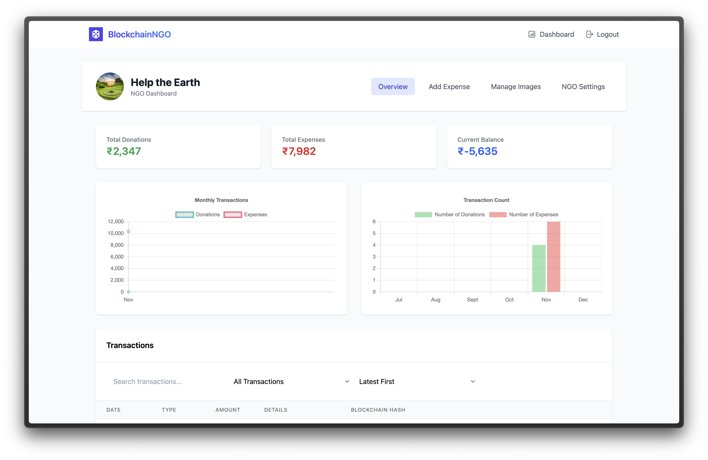

<p align="center">

<h1 align="center">
Digitized Blockchain based NGO
</h1>

<h4 align="center">A transparent donation and ngo management platform powered by blockchain technology</h4>

</p>

<br>

## Table of Contents

- [Features](#features)
- [Preview](#preview)
  - [Live Demo Video](#live-demo-video)
  - [Images](#images)
- [Tech Stack](#tech-stack)
- [Requirements](#requirements)
- [Setting Up and Installation](#setting-up-and-installation)
  - [Cloning Repository](#cloning-repository)
  - [Configuring Environment Variables](#configuring-environment-variables)
  - [Build and Run](#build-and-run)
  - [Create a superuser](#create-a-superuser)
- [Accessing the Platform](#accessing-the-platform)
- [Architecture](#architecture)
  - [Modules Overview](#modules-overview)
  - [Diagrams](#diagrams)
- [API Documentation](#api-documentation)
- [Contributing](#contributing)
- [License](#license)

<br>

## Features

BlockchainNGO offers a comprehensive platform for transparent charitable giving:

- [x] Blockchain-based transaction tracking
- [x] Secure donation processing with Razorpay integration
- [x] NGO verification and certification
- [x] Transparent expense tracking
- [x] Real-time financial dashboards
- [x] Multi-user roles (Donors, NGO Admins)
- [x] Image upload and management
- [x] Detailed transaction history

<br>

## Preview

### Live Demo Video

[Watch Here](https://drive.google.com/file/d/1phmur08L6SsV-wQAVZgBcHmFLedtUxr3/view?usp=sharing)

### Images

<p float="center">
  
   
  
  
  
  
  
</p>

## Tech Stack

**Frontend:**
- [React.js](https://reactjs.org/)
- [TailwindCSS](https://tailwindcss.com/)
- [Chart.js](https://www.chartjs.org/)
- [Razorpay SDK](https://razorpay.com/docs/api/)

**Backend:**
- [Django](https://www.djangoproject.com/)
- [Django REST Framework](https://www.django-rest-framework.org/)
- [PostgreSQL](https://www.postgresql.org/)
- [Ganache-Truffle](https://archive.trufflesuite.com/ganache/)
- [Web3.py](https://web3py.readthedocs.io/en/stable/)

**DevOps:**
- [Docker](https://www.docker.com/)
- [Docker Compose](https://docs.docker.com/compose/)

<br>

## Requirements

- [Github](https://github.com)
- [Docker](https://www.docker.com/)
- [Docker Compose](https://docs.docker.com/compose/)
- [Razorpay API Key](https://razorpay.com/docs/payments/dashboard/account-settings/api-keys/)

<br>

## Setting Up and Installation

### Cloning Repository

Clone the repository and navigate to the project directory:
```bash
git clone https://github.com/Dhruv9449/Blockchain-NGO.git
cd Blockchain-NGO
```

### Configuring Environment Variables

Create `.env` files in both frontend and backend directories using the provided templates:
```bash
cp backend/.env.example backend/.env
```

Required environment variables:

Backend:

`SECRET_KEY` - Django secret key  
`DEBUG` - Set to true for local environment, false for production  
`POSTGRES_DB` - Name of the PostgreSQL database  
`POSTGRES_USER` - Username for PostgreSQL  
`POSTGRES_PASSWORD` - Password for PostgreSQL  
`POSTGRES_HOST` - Hostname for PostgreSQL, default is db  
`POSTGRES_PORT` - Port for PostgreSQL, default is 5432  
`DJANGO_SECRET_KEY` - Django secret key  
`DJANGO_DEBUG` - Set to true for local environment, false for production  
`DJANGO_ALLOWED_HOSTS` - Allowed hosts for Django  
`DATABASE_URL` - Connection URL for PostgreSQL 
`BLOCKCHAIN_RPC_URL` - URL for the blockchain RPC  
`RAZORPAY_KEY_ID` - Razorpay API key ID  
`RAZORPAY_KEY_SECRET` - Razorpay API key secret  

### Build and Run

Start the Docker containers using Docker Compose:

```bash
docker-compose up -d --build
```

### Create a superuser

Create a superuser to access the Django admin interface:

```bash
docker-compose run backend python manage.py createsuperuser
```

<br>

## Accessing the Platform

Access the applications:
- Frontend: http://localhost:3500
- Backend API: http://localhost:8000
- Admin Interface: http://localhost:8000/admin

## Architecture

### Modules Overview

The platform follows a microservices architecture:

```
    frontend (React.js)
    ├── Public Interface
    ├── NGO Dashboard
    └── Admin Interface
    backend (Django)
    ├── NGO Management
    ├── Transaction Processing
    ├── User Authentication
    └── Blockchain Integration
    database (PostgreSQL)
    ganache (Blockchain)
    └── Local Ethereum Network
```

### Diagrams

<p float="center">
  
  
  
<br>

## API Documentation

API documentation is available at `/api/docs/` when running the backend server.

Key endpoints:
- `/api/ngos/` - NGO management
- `/api/users/` - User authentication
- `/api/transactions/` - Transaction processing

<br>

## Contributing

1. Fork the repository
2. Create your feature branch (git checkout -b feature/AmazingFeature)
3. Commit your changes (git commit -m 'Add some AmazingFeature')
4. Push to the branch (git push origin feature/AmazingFeature)
5. Open a Pull Request

<br>

## License

This project is licensed under the MIT License - see the [LICENSE](LICENSE) file for details.

<br>
<br>
<p align="center">
Developed with ❤️ by Dhruv Shah
</p>
